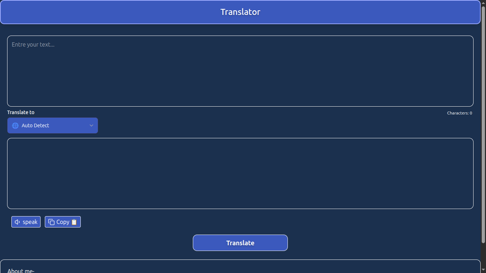
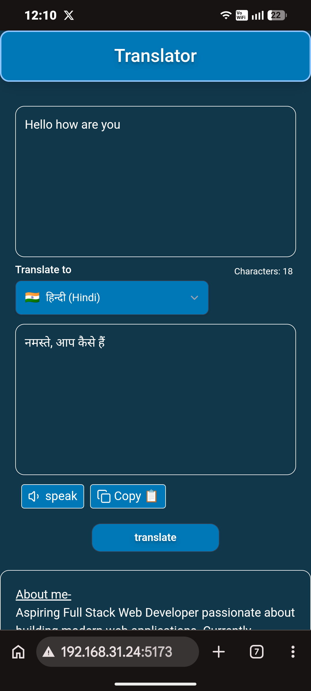

# React Translator

A responsive translator web application built using React, Tailwind CSS, and the Google Translate API via RapidAPI.

## Features

- 🌍 Translate between multiple languages
- 📋 Copy translated text
- 🔊 Text-to-Speech
- 🔢 Character Counter
- 📱 Responsive Design

<h2>Desktop Preview</h2>



<h2>Mobile Preview</h2>




## Tech Stack

- React
- Tailwind CSS
- Vite
- RapidAPI

## Installation

```bash
npm install
npm run dev
